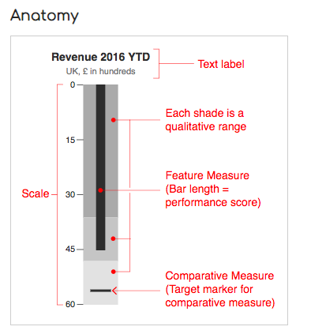

Description
----
Used to display performance data, Bullet Graphs were developed by Stephen Few as an alternative to dashboard gauges and meters. This is because they often displayed not enough information, were less space-efficient and were cluttered with "chart junk".

A Bullet Chart consists of:
* Qualitative Ranges: A collection of ranges, Qualitative Ranges, scaled to encode the window within which a Comparative Measure (Goal) and the Feature Measure (Performance) are shown. The number of Qualitative Ranges is arbitrary, with 1 being the lower (mandatory) up to 3 as the recommended maximum. The Qualitative Ranges are rendered with different color backgrounds; it is recommended that variations of a color, from darker to light.
* Feature Measure: it encodes the actual performance; it is represented by a bar narrower bar than the qualitative range bars, starting at the midpoint of the western edge of the first Qualitative Range, and ending at the point representing the actual performance.
* Comparative Measure: it encodes the goal; it is represented by a whisker, orthogonal to the Feature Measure bar, with its height equal to the height of the Qualitative Range’s boxes



The `rms-spark-bulletchart` Angular component renders two distinct bar chart types:
1. `horizontal`: when chart width &gt; chart height;
1. `vertical`: when chart width &lt; chart height;

### Usage
Below is example of a barchar sparkline. In this example, sparkline is being declared as a child of an Angular component, with its attribute values being set at the Angular's component controller.

````html
&lt;rms-spark-bulletchart
   [className] = "className"
   [height] = "height"
   [qualitativeRanges] = "qualitativeRanges"
   [width] = "width"
&gt;
&lt;/rms-spark-bulletchart&gt;
````

#### Properties
* `className: string`: A classe names to be added to the canvas element. Default is no classes;
* `height: number`: The height of the sparkline box in pixels;
* `qualitativeRanges`: number**: The chart's qualitative ranges;
* `width: number`: The width of the sparkline box in pixels. See the source for comments on how to fit bars into the provided box;


### Methods
none

### Events Received
none

### Events Emitted
none

# Last but not least
````html
_   _                   _____
| | | | __ ___   _____  |  ___|   _ _ __
| |_| |/ _` \ \ / / _ \ | |_ | | | | '_ \
|  _  | (_| |\ V /  __/ |  _|| |_| | | | |
|_| |_|\__,_| \_/ \___| |_|   \__,_|_| |_|
````
